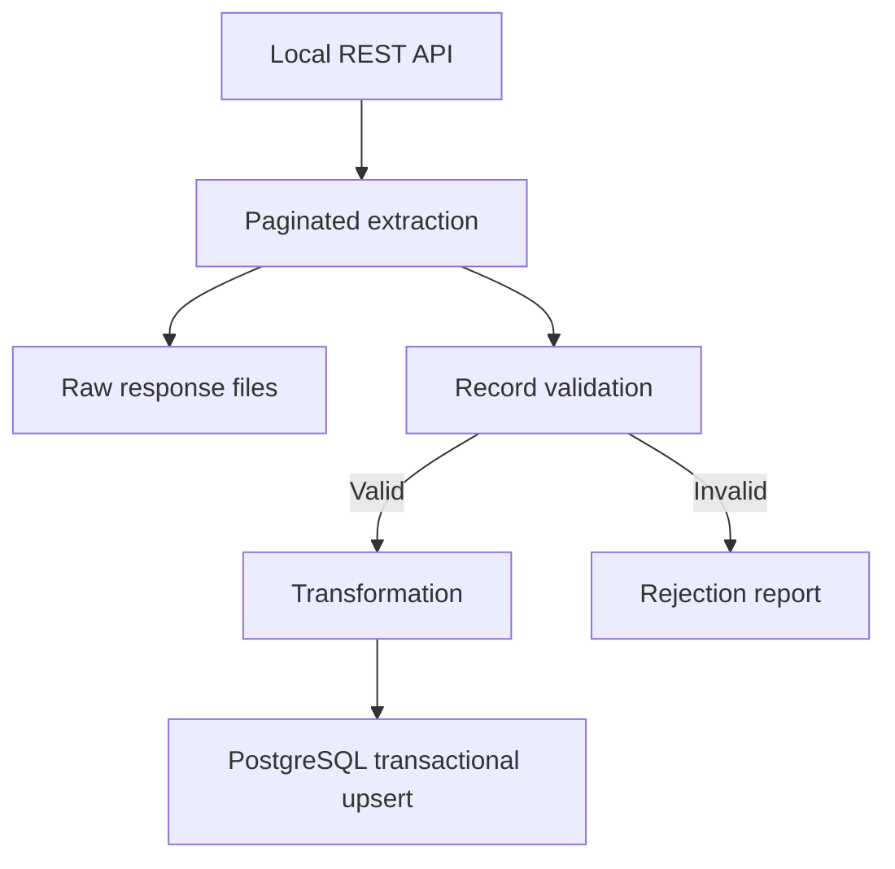

# Partner Catalog Ingestion

[](https://github.com/JakLit00/partner-catalog-ingestion/actions/workflows/quality-checks.yml)

[](LICENSE)

A Python batch pipeline that imports a partner's product catalog from a REST API into PostgreSQL. It saves source responses, separates invalid records with rejection reasons, and updates existing products in one database transaction.

The business scenario is a company maintaining a partner catalog for internal applications that need product names, categories, prices and stock levels. A fixed snapshot of 194 products is served locally, making the demonstration independent of changes to the public source API.

## Stack

- **Python 3.13 / 3.14** — Requests, urllib3, Psycopg 3 and `Decimal`.
- **PostgreSQL 16** — constraints, transactional upserts and a restricted importer role.
- **Docker Compose** — PostgreSQL and a read-only JSON Server API.
- **python-dotenv and python-json-logger** — configuration and JSON console logs.
- **pytest, Ruff and GitHub Actions** — automated tests, code checks and formatting.

## Data flow



The importer requests 25 products per page until the API returns an empty list. GET requests use a timeout and retries with exponential backoff. Database loading starts only after extraction, validation and the rejection report have completed. A database error rolls back the load; previously written files remain available.

## Run locally

### 1. Prepare the environment

Use Python **3.13 or 3.14**, Docker with Docker Compose, and a clone or extracted copy of this repository. On Windows, Docker Desktop must use Linux containers. Host ports **3000** and **5433** must be available. Node.js and PostgreSQL run inside containers; neither needs a host installation.

Run commands from the repository root and stop if a command fails. Initial dependency installation and image builds require internet access. Imports use the bundled local dataset.

**Windows — PowerShell**

```powershell
py -3.13 -m venv .venv
.\.venv\Scripts\python.exe -m pip install -r requirements-dev.txt
Copy-Item .env.example .env
```

**Linux — Bash**

```bash
python3 --version
python3 -m venv .venv
.venv/bin/python -m pip install -r requirements-dev.txt
cp .env.example .env
```

Create `.env` only on first setup; do not overwrite an existing configuration. Explicit interpreter paths avoid requiring virtual environment activation. `requirements-dev.txt` includes runtime dependencies, pytest and Ruff.

On Ubuntu, if environment creation reports missing `ensurepip`, install the venv package matching your interpreter, such as `sudo apt install python3.14-venv` for Python 3.14, then repeat environment creation.

For WSL2, enable the Ubuntu distribution in Docker Desktop's **Settings → Resources → WSL Integration** and check that `docker ps` works. Use a Linux checkout under `~/projects` with its own `.venv` and `.env`; do not copy a Windows virtual environment. See [platform notes](docs/development-notes.md#8-platform-verification).

### 2. Configure credentials

Edit `.env`:

```dotenv
POSTGRES_DB=partner_catalog
POSTGRES_ADMIN_USER=catalog_app
POSTGRES_ADMIN_PASSWORD=replace_with_your_local_admin_password
POSTGRES_USER=catalog_ingestor
POSTGRES_PASSWORD=replace_with_your_local_app_password
POSTGRES_HOST=127.0.0.1
POSTGRES_PORT=5433
API_BASE_URL=http://127.0.0.1:3000
API_TIMEOUT_SECONDS=10
```

Replace both password placeholders with different passwords. `.env` is ignored by Git; `.env.example` contains placeholders only.

Docker Compose maps `POSTGRES_ADMIN_USER` and `POSTGRES_ADMIN_PASSWORD` to the image's initialization settings. The administrator creates the schema and grants permissions. Python uses `POSTGRES_USER` and `POSTGRES_PASSWORD` to connect as the restricted `catalog_ingestor` role. Its password must also be set in PostgreSQL in step 3.

Keep the supplied role names when following these instructions: `sql/002_create_app_role.sql` explicitly creates `catalog_ingestor`. If changing the database or administrator name, adjust the `-d` and `-U` arguments below. Changing `.env` does not modify credentials in an existing database. Existing process environment variables take precedence over `.env` values.

`API_TIMEOUT_SECONDS` must be positive and finite; `POSTGRES_PORT` must be an integer from 1 to 65535. Client ports must match the mappings in `compose.yaml`.

### 3. Start services and initialize a new database

The following commands work in PowerShell and Bash:

```text
docker compose config --quiet
docker compose up -d --build
docker compose exec postgres pg_isready -U catalog_app -d partner_catalog
```

Wait for `accepting connections`, repeating the last command if necessary. The API is available at `http://127.0.0.1:3000/products`.

For a **new database**, run the SQL scripts in order:

```text
docker compose cp sql/001_create_products.sql postgres:/tmp/001_create_products.sql
docker compose exec postgres psql -U catalog_app -d partner_catalog -v ON_ERROR_STOP=1 -1 -f /tmp/001_create_products.sql

docker compose cp sql/002_create_app_role.sql postgres:/tmp/002_create_app_role.sql
docker compose exec postgres psql -U catalog_app -d partner_catalog -v ON_ERROR_STOP=1 -1 -f /tmp/002_create_app_role.sql
```

Expected results: `CREATE TABLE`, followed by `CREATE ROLE` and three `GRANT` messages. Each script runs in one transaction and stops on error. These scripts are not rerunnable migrations: skip table creation if the table already exists and role creation if the role and grants have already been configured. The importer does not create them automatically.

Set the application password interactively:

```text
docker compose exec postgres psql -U catalog_app -d partner_catalog
```

At the `psql` prompt, enter:

```text
\password catalog_ingestor
```

Enter the same password used for `POSTGRES_PASSWORD` in `.env`, then repeat it when prompted. Input is hidden. Exit with:

```text
\q
```

The SQL script does not contain a password. Ordinary container restarts do not require repeating initialization or password setup.

### 4. Import and inspect the catalog

**Windows**

```powershell
.\.venv\Scripts\python.exe check_connection.py
.\.venv\Scripts\python.exe extract.py
```

**Linux**

```bash
.venv/bin/python check_connection.py
.venv/bin/python extract.py
```

The connection check should identify `catalog_ingestor`. The success log reports `product_count: 194`, `valid_count: 194`, `rejected_count: 0` and `loaded_count: 194`, together with a run ID.

Verify the database and run the example queries:

```text
docker compose exec postgres psql -U catalog_ingestor -d partner_catalog -c "SELECT COUNT(*) AS product_count FROM public.products;"
docker compose cp sql/example_queries.sql postgres:/tmp/example_queries.sql
docker compose exec postgres psql -U catalog_ingestor -d partner_catalog -v ON_ERROR_STOP=1 -P pager=off -f /tmp/example_queries.sql
```

The count remains **194** after repeated imports. Existing IDs are updated; `loaded_count` includes updates and is not a count of newly inserted rows. The queries cover a catalog summary, sample records, out-of-stock products and availability by category.

For optional pgAdmin access, use host `127.0.0.1`, port `5433`, database `partner_catalog`, user `catalog_ingestor` and its password.

## Output and failure handling

- `data/raw/<run_id>/page_0001.json`, etc. contain response text saved as UTF-8 before parsing. The dataset produces eight populated pages and a final empty ninth page.
- `data/rejected/<run_id>.json` contains rejected records and their validation errors, or `[]`. Non-finite numbers are represented as strings (`"NaN"`, `"Infinity"`, `"-Infinity"`) to keep the report valid JSON. The raw response remains available separately.
- `public.products` contains the five validated and transformed fields: `id`, `title`, `category`, `price` and `stock`.

Validation checks required fields, integer bounds, nonnegative stock, finite nonnegative prices, and nonblank text without NUL characters. Transformation trims outer whitespace and converts prices with `Decimal(str(value))`. No currency or rounding rule is assumed.

The run ID uses UTC and links console logs to output files. Failure logs include the stage and, during extraction, the page number. Handled failures exit with code `1`; completed runs exit with `0`, including runs with rejected records. A failed run may leave partial files. File presence alone does not confirm a committed database transaction.

## Tests and code quality

**Windows**

```powershell
.\.venv\Scripts\python.exe -m ruff check .
.\.venv\Scripts\python.exe -m ruff format . --check
.\.venv\Scripts\python.exe -m pytest -q
```

**Linux**

```bash
.venv/bin/python -m ruff check .
.venv/bin/python -m ruff format . --check
.venv/bin/python -m pytest -q
```

The default run executes **73 cases** and skips **eight PostgreSQL integration cases**. It covers validation, transformation, configuration, file output, pagination, failure handling and recovery after HTTP 503. These 73 cases require no Docker, database credentials or external API. The retry test starts a temporary loopback HTTP server; other HTTP interactions are mocked.

### PostgreSQL integration tests

The integration suite uses a separate, disposable PostgreSQL instance. It checks schema and role initialization, committed inserts, upserts without duplicates, constraint failure with full transaction rollback, and denial of DELETE, TRUNCATE, DROP TABLE and CREATE TABLE for the importer role.

Use the same Python environment and installed development dependencies as above. Docker must be running and host port **55432** must be free. The ordinary API, demo database and application `.env` are not required.

Start the test database from the repository root, in either PowerShell or Bash:

```text
docker compose -f compose.test.yaml up -d --wait
```

Compose waits for PostgreSQL readiness. Initialization creates the table and restricted role using the project's SQL scripts, then sets the disposable application password automatically.

Run the complete suite, including integration cases:

**Windows**

```powershell
.\.venv\Scripts\python.exe -m pytest -q --run-integration
```

**Linux**

```bash
.venv/bin/python -m pytest -q --run-integration
```

Expected result: **81 passed**. To run only the eight database cases, add `tests/integration` after `pytest` in the corresponding command.

After testing, remove the test service, including after a failed test run:

```text
docker compose -f compose.test.yaml down
```

The test configuration uses its own Compose project, loopback port 55432 and temporary database storage. It does not mount the demo database's persistent volume. Fixed test credentials are deliberately included in the repository; use them only for this disposable local instance, never for a shared or deployed database. Loopback binding limits network exposure but does not prevent access by other processes on the same host.

Database tests clear `public.products` before and after each data-changing test. Run them sequentially against this instance. Stopping the test container discards its database contents; starting an already running container does not reset them. For a fresh initialization, run `down` followed by `up -d --wait`. To inspect a startup failure, use `docker compose -f compose.test.yaml logs --no-color`.

### CI and manual checks

[GitHub Actions](.github/workflows/quality-checks.yml) runs five jobs on pushes to `main`, pull requests targeting `main`, and manual dispatch:

- Four quality jobs cover Python 3.13 and 3.14 on Ubuntu and Windows. Each runs Ruff and the default pytest suite.
- One integration job uses Ubuntu and Python 3.13, starts the disposable PostgreSQL instance, runs all eight database cases, and removes the service even if tests fail. Database logs are printed on failure.

No application secrets are needed by CI. The workflow checks the database boundary automatically; it does not run the complete local API-to-database import.

After a demo import, `check_rollback.py` remains available as an optional manual check:

```powershell
# Windows
.\.venv\Scripts\python.exe check_rollback.py
```

```bash
# Linux
.venv/bin/python check_rollback.py
```

It uses the application `.env` and product ID `1` in the demo database, attempts a valid update followed by invalid stock in one transaction, and verifies that the original row is unchanged.

See [verification results](docs/development-notes.md#9-verification-results) for completed local and CI checks.

## Stop and restart

```text
docker compose stop
docker compose up -d
```

Database contents and roles persist in the named volume. Removing the volume deletes them; changing passwords in `.env` does not update stored role passwords.

## Scope and trade-offs

- The catalog is held in memory. Scheduling, checkpoints, concurrent runs and file retention are outside this local batch workflow.
- Upserts refresh incoming IDs. Missing or rejected source products do not delete existing rows, and no price history is retained.
- The importer has `SELECT`, `INSERT` and `UPDATE` on `products`. Administration uses a separate superuser account. Services bind to host loopback addresses and are intended for local use.
- Dependency pins and image tags improve repeatability; transitive dependencies and image digests are not fully locked.

## Dataset

The snapshot comes from [DummyJSON](https://dummyjson.com/docs/products). `api/catalog-source.json` retains the downloaded response; `api/db.json` supplies JSON Server's product collection. Image URLs are metadata only. The upstream MIT notice is preserved in [api/DUMMYJSON-LICENSE.txt](api/DUMMYJSON-LICENSE.txt).

[Development notes](docs/development-notes.md) describe the implementation sequence and the reasons behind the main decisions.

## License

The project code is licensed under the [MIT License](LICENSE).

The bundled DummyJSON dataset retains its upstream license notice in
[api/DUMMYJSON-LICENSE.txt](api/DUMMYJSON-LICENSE.txt).
