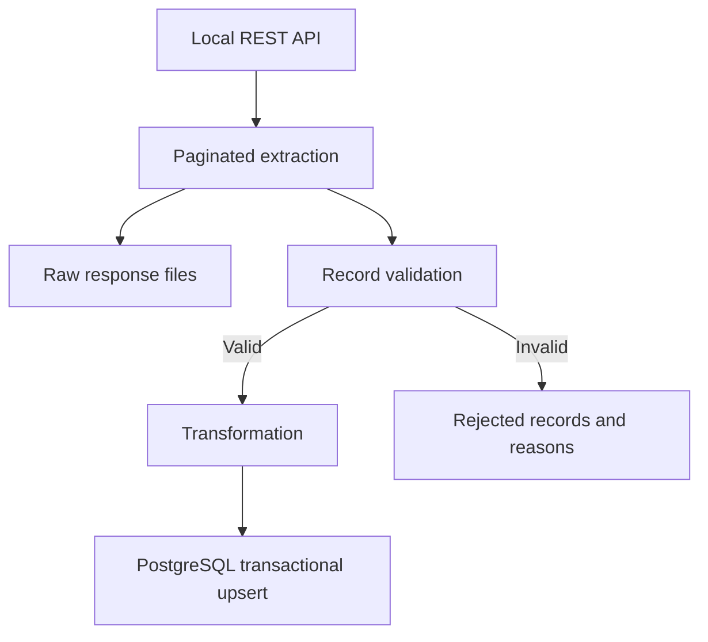

# Partner Catalog Ingestion

A Python pipeline that imports a partner's product catalog from a REST API into PostgreSQL. It preserves source responses, rejects invalid records with reasons, and updates existing products without creating duplicate IDs.

The business scenario is a company maintaining a local catalog of a partner's products, prices and stock levels for internal applications. A fixed, locally served dataset keeps the demonstration repeatable without depending on a public API at runtime.

## Stack

- **Python** — Requests and urllib3 for HTTP, Psycopg 3 for database access, `Decimal` for transformed prices.
- **PostgreSQL 16** — typed columns, data constraints and transactional upserts.
- **Docker Compose** — PostgreSQL and a read-only JSON Server API; Node.js runs inside the API image.
- **pytest** — isolated tests with mocked HTTP responses and temporary output directories.
- **python-dotenv and python-json-logger** — environment configuration and structured console logs.

## Data flow



The importer requests 25 products per page until it receives an empty list. GET requests use a configurable timeout and a retry policy with exponential backoff. Valid products are loaded in one database transaction; a database error rolls back that transaction. Source and rejection files remain available independently of the database outcome.

## Run locally

**Requirements:** Git or a downloaded repository, Python 3.13 or 3.14, and Docker with Docker Compose. Use Linux containers in Docker Desktop on Windows. Ports **3000** and **5433** must be available. Initial installation and image builds require internet access; normal imports do not contact DummyJSON. Node.js, PostgreSQL and pgAdmin do not need to be installed on the host.

Run all commands from the repository root. Stop at any failed command before continuing.

### 1. Prepare Python and configuration

Clone or extract the repository, then open its directory. Choose the commands for your operating system. Create `.env` only on first setup; keep an existing configuration.

**Windows — PowerShell**

```powershell
py -3.13 -m venv .venv
Copy-Item .env.example .env
.\.venv\Scripts\python.exe -m pip install -r requirements-dev.txt
```

**Linux — Bash**

```bash
python3 --version
python3 -m venv .venv
cp .env.example .env
.venv/bin/python -m pip install -r requirements-dev.txt
```

Use Python 3.13 or 3.14 for this setup. If Ubuntu reports that `ensurepip` is unavailable, install the matching venv package and repeat environment creation. For the verified Python 3.14 installation:

```bash
sudo apt update
sudo apt install python3.14-venv
```

For Ubuntu in WSL2, enable Ubuntu under **Docker Desktop → Settings → Resources → WSL Integration** and confirm `docker ps` works. Keep the Linux checkout under a directory such as `~/projects` and create its own `.venv`; do not reuse a Windows virtual environment. See [WSL environment notes](docs/development-notes.md#8-windows-and-linux-verification) for the configuration details.

The commands below use explicit interpreter paths, so terminal activation is optional. `requirements-dev.txt` includes runtime dependencies plus pytest; use `requirements.txt` if only runtime dependencies are needed.

### 2. Set local credentials

Edit `.env` and replace the password placeholder:

```dotenv
POSTGRES_DB=partner_catalog
POSTGRES_USER=catalog_app
POSTGRES_PASSWORD=replace_with_your_local_password
POSTGRES_HOST=127.0.0.1
POSTGRES_PORT=5433
API_BASE_URL=http://127.0.0.1:3000
API_TIMEOUT_SECONDS=10
```

These settings match the supplied Compose file. `.env` is ignored by Git. Existing environment variables take precedence over values loaded from `.env`.

Database credentials initialize an empty PostgreSQL volume. Editing `.env` does **not** change the password in an existing database. Host ports are fixed in `compose.yaml`; changing a port in `.env` alone does not change the Docker port mapping.

### 3. Start the services and create the table

These commands work in PowerShell and Bash:

```text
docker compose config --quiet
docker compose up -d --build
docker compose exec postgres pg_isready -U catalog_app -d partner_catalog
```

Wait for `accepting connections`; repeat the last command if PostgreSQL is still starting. The API serves `http://127.0.0.1:3000/products`.

For a **new database**, create the table:

```text
docker compose cp sql/001_create_products.sql postgres:/tmp/001_create_products.sql
docker compose exec postgres psql -U catalog_app -d partner_catalog -v ON_ERROR_STOP=1 -1 -f /tmp/001_create_products.sql
```

Expected result: `CREATE TABLE`. Run this DDL once per database; an existing `products` table is not replaced. The importer does not create the schema automatically. If you changed the database or user names, adjust `-d` and `-U` in the commands accordingly.

### 4. Import and verify

**Windows**

```powershell
.\.venv\Scripts\python.exe check_connection.py
.\.venv\Scripts\python.exe extract.py
```

**Linux**

```bash
.venv/bin/python check_connection.py
.venv/bin/python extract.py
```

The bundled catalog produces this result; timestamp and run ID vary:

```json
{"asctime":"2026-09-20 14:00:01,000","levelname":"INFO","name":"__main__","message":"Catalog ingestion completed","run_id":"20260920T120000_000000Z","product_count":194,"valid_count":194,"rejected_count":0,"loaded_count":194}
```

Check PostgreSQL:

```text
docker compose exec postgres psql -U catalog_app -d partner_catalog -c "SELECT COUNT(*) AS product_count FROM products;"
```

Expected count: **194**, including after a second import. Existing IDs are updated. `loaded_count` counts valid records submitted to the successful transaction, including updates; it is not a count of newly inserted rows.

Run the supplied examples to inspect products, price ranges and availability by category:

```text
docker compose cp sql/example_queries.sql postgres:/tmp/example_queries.sql
docker compose exec postgres psql -U catalog_app -d partner_catalog -v ON_ERROR_STOP=1 -P pager=off -f /tmp/example_queries.sql
```

For optional pgAdmin access, use host `127.0.0.1`, port `5433`, database `partner_catalog`, user `catalog_app` and the password from `.env`.

## Output and validation

Each run writes:

- `data/raw/<run_id>/page_0001.json`, etc. — response text saved as UTF-8 before parsing. The bundled dataset produces eight populated pages and a ninth containing `[]`.
- `data/rejected/<run_id>.json` — original invalid records with their validation errors; `[]` when none are rejected.
- `products` in PostgreSQL — `id`, `title`, `category`, `price` and `stock` for valid records.

The run ID uses UTC. Generated files are ignored by Git. Console logs are JSON; they are not automatically written to the `logs/` directory.

Validation requires a positive `BIGINT`-compatible ID, nonblank title and category, nonnegative `BIGINT`-compatible stock, and a finite, nonnegative numeric price. Booleans and numeric strings are rejected for numeric fields. Transformation trims outer whitespace, selects the five database fields and converts price with `Decimal(str(value))`. No currency or rounding rule is invented.

Invalid records are excluded while valid records continue to loading. Handled configuration, request, file and database failures produce an error log and exit code `1`; a completed run exits with `0`, even if some records were rejected. A failed run may leave partial files; those files do not prove that the database transaction committed.

## Tests

**Windows**

```powershell
.\.venv\Scripts\python.exe -m pytest -v
```

**Linux**

```bash
.venv/bin/python -m pytest -v
```

The suite contains **53 test cases**, including parameterized cases. It checks response structure, HTTP error propagation, raw and rejected file output, field validation, `BIGINT` boundaries and transformation. It needs neither Docker nor a live API or database.

After a successful import, check transaction rollback against the local demo database:

```powershell
# Windows
.\.venv\Scripts\python.exe check_rollback.py
```

```bash
# Linux
.venv/bin/python check_rollback.py
```

This check requires product ID `1`. It attempts a price change followed by an invalid stock value in the same transaction, then verifies that the original row is unchanged. Expected result: `Rollback verified: the original product is unchanged.`

Verified configurations: **Windows / Python 3.13.14** and **Ubuntu 26.04 in WSL2 / Python 3.14.4**, using Docker Desktop. Both passed the suite, full ingestion and rollback checks. A separate empty database was also initialized and loaded under WSL2. This does not constitute a test on a separate, freshly provisioned machine. See [verification details](docs/development-notes.md#9-verification-results).

## Stop and restart

```text
docker compose stop
docker compose up -d
```

The first command stops services; the second starts them again. Data remains in the named PostgreSQL volume. Ordinary restarts do not require rerunning the DDL.

## Scope and trade-offs

- This is a local batch importer for one fixed source. It keeps the catalog in memory and does not implement scheduling, checkpoints or concurrent runs.
- Upserts refresh incoming IDs. Products absent from the source, or rejected in a later run, are not deleted from the database.
- The local database account created by `POSTGRES_USER` is a superuser. The configuration is for a local demo, not an exposed production service.
- Files have no automatic retention policy. Dependency pins and image tags improve repeatability but are not a complete dependency lock or a guarantee of permanent compatibility.

## Dataset and implementation notes

The 194-product snapshot comes from [DummyJSON](https://dummyjson.com/docs/products). `api/catalog-source.json` retains the downloaded response; `api/db.json` contains the collection used by JSON Server. Image URLs remain source metadata; images are not downloaded. The upstream MIT notice is preserved in [api/DUMMYJSON-LICENSE.txt](api/DUMMYJSON-LICENSE.txt).

[Development notes](docs/development-notes.md) explain the implementation sequence, module responsibilities, design decisions and verification methods.
