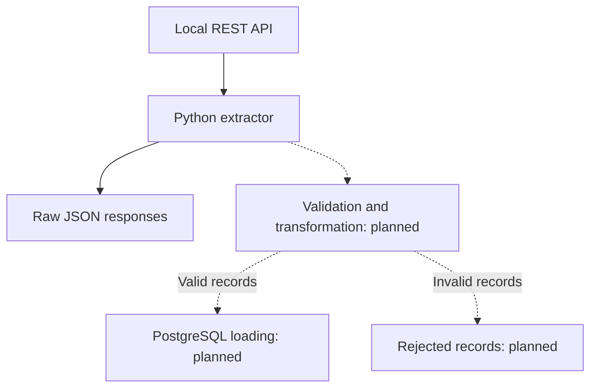

# Partner Catalog Ingestion

A Python project for importing a partner's product catalog from a REST API into PostgreSQL.

## Purpose and status

A company needs a structured local copy of a partner's product catalog for internal applications. The importer is being built to fetch all API pages, retain raw responses, validate records and load valid products without creating duplicates on repeated imports.

**Implemented:** a fixed local REST API with 194 products, PostgreSQL connectivity, paginated extraction with timeout and bounded retries, JSON logging, raw-response files and four automated tests.

**Next:** record validation and transformation, rejected-record output, a product table and database loading. The extraction script does not yet write products to PostgreSQL.

## Data flow



The dataset is a committed snapshot of 194 sample products from [DummyJSON](https://dummyjson.com/docs/products). `api/catalog-source.json` preserves the source response; `api/db.json` contains the collection served by JSON Server. Image URLs remain text; images are not downloaded. The upstream MIT license is included in [api/DUMMYJSON-LICENSE.txt](api/DUMMYJSON-LICENSE.txt).

## Run locally

The commands below have been verified using **Windows PowerShell** and run from the project directory. Windows and Linux are target platforms; Linux verification is pending.

**Requirements:** Python 3.13 and Docker with Docker Compose. Docker Desktop must be running with Linux containers on Windows. Initial dependency installation and image builds require internet access. Normal extraction uses the local API without contacting DummyJSON.

### 1. Configure the environment

On first setup:

```powershell
Copy-Item .env.example .env
```

Keep an existing `.env` instead of overwriting it. Set your own local password and check these settings:

```dotenv
POSTGRES_DB=partner_catalog
POSTGRES_USER=catalog_app
POSTGRES_PASSWORD=replace_with_your_local_password
POSTGRES_HOST=127.0.0.1
POSTGRES_PORT=5433
API_BASE_URL=http://127.0.0.1:3000
API_TIMEOUT_SECONDS=10
```

`.env` is ignored by Git. Changing its database credentials does not update an already initialized database.

### 2. Install dependencies

Create the virtual environment if it does not exist, then install runtime dependencies:

```powershell
py -3.13 -m venv .venv
.\.venv\Scripts\python.exe -m pip install -r requirements.txt
```

The explicit interpreter path avoids requiring terminal activation.

### 3. Start the services

```powershell
docker compose up -d --build
docker compose exec postgres pg_isready -U catalog_app -d partner_catalog
```

Wait until PostgreSQL reports `accepting connections`. PostgreSQL is exposed at `127.0.0.1:5433`; the read-only API is exposed at `127.0.0.1:3000`.

The API uses `_page` and `_limit` for pagination and returns the total count in `X-Total-Count`. The extractor requests pages until it receives an empty list.

### 4. Check connectivity and extract the catalog

```powershell
.\.venv\Scripts\python.exe check_connection.py
.\.venv\Scripts\python.exe extract.py
```

The connection check should report `partner_catalog` and `catalog_app`. Successful extraction emits a JSON log with `message: "Catalog extraction completed"` and `product_count: 194`.

Each extraction creates a UTC timestamp directory under `data/raw/`. With a page size of 25, the current dataset produces eight populated files and a ninth file containing `[]`. Response text is saved as UTF-8 before JSON parsing, after checking the HTTP status. Generated files are ignored by Git.

Handled request errors and invalid response structures produce an `ERROR` log with exception details and exit code `1`. A failed run can leave partial raw output.

To stop both services while retaining database data:

```powershell
docker compose stop
```

Restart them with `docker compose up -d`.

## Tests

Install development dependencies and run the suite:

```powershell
.\.venv\Scripts\python.exe -m pip install -r requirements-dev.txt
.\.venv\Scripts\python.exe -m pytest -v
```

The four tests cover list responses, rejection of non-list responses, propagation of HTTP errors and preservation of response text in raw files. HTTP responses are mocked and files use temporary directories; the suite does not require Docker or a running API. It does not yet verify retries or multi-page extraction automatically.

## Current limitations

- Product validation, transformation, rejected-record output and database loading are not implemented yet.
- Execution and tests have been verified on Windows only. Linux and clean-environment reproduction remain to be checked; Python runs in a local virtual environment.
- The local PostgreSQL user created through `POSTGRES_USER` has superuser privileges. A separate least-privilege application role is not implemented.
- Version pins improve repeatability but do not guarantee indefinite compatibility or immutable image contents.

## Development notes

[Development notes](docs/development-notes.md) describe implementation decisions and verification results.
