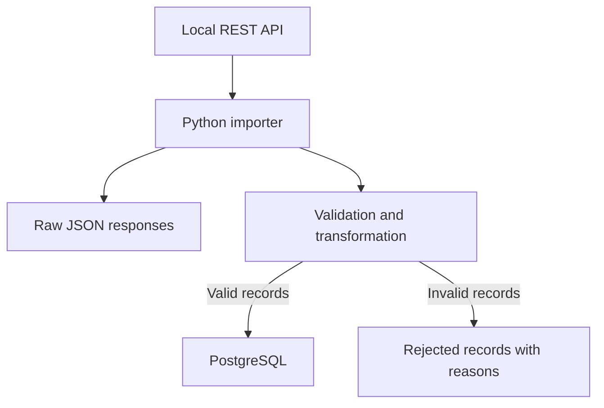

# Partner Catalog Ingestion

A Python project for importing a partner's product catalog from a REST API into PostgreSQL.

## Purpose and status

A company needs a structured local copy of a partner's product catalog for internal applications. The planned importer will fetch all API pages, retain raw responses, validate records and load valid products without creating duplicates on repeated imports.

**Under development:** local PostgreSQL setup, a Python connection check and a fixed 194-product dataset are available. The API, ingestion pipeline, product table and automated tests are not implemented yet.

## Planned data flow



The demo dataset contains 194 sample products from
[DummyJSON](https://dummyjson.com/docs/products).

`api/catalog-source.json` preserves the downloaded API response.
`api/db.json` contains the product collection prepared for JSON Server.
Image URLs are retained as text; image files are not downloaded.

The upstream project's MIT license is included in
[api/DUMMYJSON-LICENSE.txt](api/DUMMYJSON-LICENSE.txt).

The local API is available. The ingestion pipeline is not implemented yet.

## Run the current version

These instructions target **Windows PowerShell** and should be run from the project directory.

**Requirements:** Python 3.13 and Docker with Docker Compose. Docker Desktop must be running with Linux containers. Internet access is required to download dependencies and the PostgreSQL image on initial setup.

### 1. Configure the database

On first setup, copy the template:

```powershell
Copy-Item .env.example .env
```

If `.env` already exists, keep it instead of overwriting it. Set your own local database password in `.env` and check these values:

```dotenv
POSTGRES_DB=partner_catalog
POSTGRES_USER=catalog_app
POSTGRES_PASSWORD=replace_with_your_local_password
POSTGRES_HOST=127.0.0.1
POSTGRES_PORT=5433
```

`.env` is ignored by Git; `.env.example` contains placeholders only. Database credentials are applied on first initialization of an empty data volume. Editing `.env` later does not change an existing database password.

### 2. Install Python dependencies

Create the virtual environment if it does not exist, then install dependencies:

```powershell
py -3.13 -m venv .venv
.\.venv\Scripts\python.exe -m pip install -r requirements.txt
```

Using the explicit interpreter path avoids requiring terminal activation.

### 3. Start and check PostgreSQL

```powershell
docker compose up -d postgres
docker compose exec postgres pg_isready -U catalog_app -d partner_catalog
```

Wait until the readiness check reports `accepting connections`. The database is exposed only on `127.0.0.1:5433`; port `5432` is used inside the container.

### 4. Run the Python connection check

```powershell
.\.venv\Scripts\python.exe check_connection.py
```

Expected output with the example database and user names:

```text
Connected to database: partner_catalog as user: catalog_app
```

The script loads configuration, connects with a five-second connection timeout and executes `SELECT current_database(), current_user;`. It does not import products.

To stop PostgreSQL:

```powershell
docker compose stop postgres
```

Database files are retained in the named Docker volume. Start the service again with `docker compose up -d postgres`.

## Running the local API

Build and start the service:

```powershell
docker compose up -d --build api
```

Request the first page:

```powershell
Invoke-RestMethod -Uri "http://127.0.0.1:3000/products?_page=1&_limit=25"
```

The API serves a fixed catalog of 194 products in read-only mode.
Pagination uses `_page` and `_limit`; the `X-Total-Count` response
header provides the total record count.

The initial image build requires internet access. After the image
has been built, serving the catalog does not require DummyJSON.

To stop the service:

```powershell
docker compose stop api
```

## Verification and limitations

- The connection check is a manual smoke check, not an automated test suite. Automated tests are planned.
- Only the Windows/PowerShell workflow has been manually verified so far. The Python script currently runs in a local virtual environment, not a container.
- This is a local demo configuration. The official PostgreSQL image creates `POSTGRES_USER` as a database superuser; application-specific least-privilege access is not implemented yet.
- Pinned package versions and a specific PostgreSQL image tag improve repeatability, but do not guarantee indefinite compatibility with future systems or identical image bytes.

## Documentation

[Development notes](docs/development-notes.md) record implementation stages, decisions, issues and verification results. This README remains the entry point for running the project.
